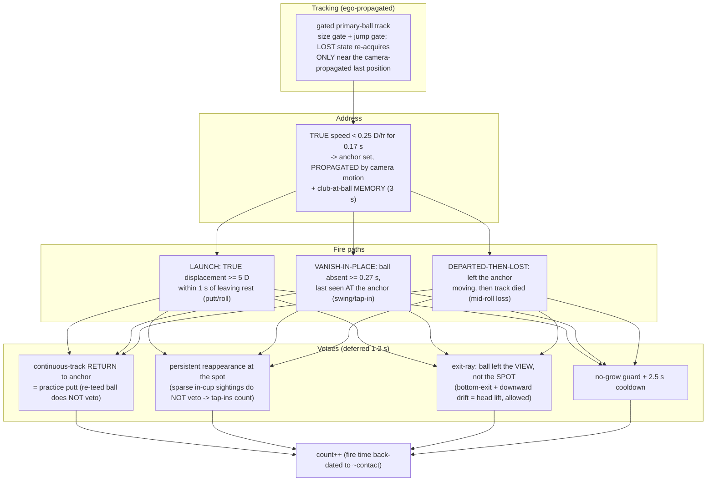

# Golf Hit Counter — System Documentation

End-to-end documentation of the egocentric (AR-glasses / head-cam / phone) golf hit-counting
system: what it does, how the algorithm works, the Android app, the offline pipeline, validation
results, and known limits. The detector itself is documented separately in **GOLF_YOLO.md**;
data collection in **GOLF_COLLECTION.md**; the original research plan in **GOLF_PLAN.md**.

---

## 1. What it does

Counts golf **hits** — putts, chips, and full swings — from a first-person camera, live on a
phone or offline over recorded video. Input is only the 2-class YOLO detector output
(`ball`, `club_head` boxes) plus a camera-motion estimate; no IMU, no audio, no ball-flight
tracking (physically impossible at 30 fps — a driven ball crosses ~43 ball-diameters per frame).

Two deployments share one algorithm:

| | Offline (reference) | Android (live) |
|---|---|---|
| Entry point | `golf/annotate_status.py` | `GolfActivity` ("Golf Hits" launcher) |
| Detector | `golf_ego_v2` @1280, GPU | same model, TFLite f16 @640, ~15 fps |
| Camera motion | optical-flow affine (`golf/cam_affine.py`) | `GlobalMotion.kt` local block match |
| Algorithm | `golf/hit_detector.py` v3 ("ego-fusion") | `HitCounter.kt` (online port) |
| Output | annotated `_status.mp4` + hit times | live count + state HUD |
| Measured accuracy | **14/15 hits, 0 false** (8 clips) | **12/14 hits, 0 false** (simulated port) |

---

## 2. The core idea: subtract the camera

Everything hard about this problem comes from one fact: **the camera is on a moving head**.
Raw image motion mixes ball motion with head motion, which caused both failure modes of the
earlier detectors:

- **Walk-away false hits** — the wearer turns/walks away from a resting ball; the ball's image
  track drifts out of the frame, indistinguishable in raw pixels from "launched and vanished".
- **Missed short putts** — a 2–4 m putt stops ~10 diameters away; any raw-motion confirm
  threshold high enough to reject walking (≥14 D) also rejects the putt.

The fix is ego-motion compensation: estimate the camera's motion from the **background** and
work in ground-relative ("TRUE") coordinates. Measured on real footage (units: ball diameters D
per frame @30 fps):

| situation | RAW image speed | TRUE (ego-compensated) |
|---|---|---|
| ball resting, head walking/turning | 0.4 – 0.7 D/fr | **0.03 – 0.11** (≈ 0) |
| real putt rolling | 0.6 – 1.0 D/fr | **~1.05** |

With ~10× separation between "static" and "rolling", a low **5 D TRUE-displacement** confirm is
safe — that single change removes the walk-away false fires *and* recovers short-putt recall.

Camera-motion sources:
- **Offline**: per-frame affine from background optical flow — half-res LK on
  `goodFeaturesToTrack` (detections masked out) + RANSAC `estimateAffinePartial2D`
  (`golf/cam_affine.py`, ~0 estimation failures across 8 clips).
- **Phone**: `GlobalMotion.kt` — SAD block match on a 160×160 luma downsample (48 px patch,
  ±16 search, coarse-to-fine), **sampled locally at the ball/anchor position**, ~2 ms/frame,
  no OpenCV dependency. Translation-only, which is sufficient *locally* over the short windows
  the algorithm compares (validated, §6).

---

## 3. The algorithm (v3 "ego-fusion")

Chosen by an adversarial 5-design evaluation against a labeled oracle (6 real + 10 confirmed-
false events on 4 dev clips), then blind-tested on 4 held-out clips; v3 merges the two winning
designs, whose held-out misses were complementary. Reference implementation:
`golf/hit_detector.py`; Kotlin twin: `HitCounter.kt`.



Design decisions worth knowing (each is load-bearing, measured on real footage):

- **The club head is never required at the moment of impact.** Motion blur makes it invisible
  at contact in 2 of 6 real swings; instead a 3 s *memory* of "club was at the ball" gates the
  fire. For putts the club stays detected through contact.
- **Vanish-in-place vs view-exit** is what separates a full swing (ball gone in 1–2 frames,
  last seen at the anchor) from a walk-away (ball drifts smoothly out of the frame edge).
- **Continuous-track return** distinguishes a practice putt (the SAME tracked ball comes back)
  from re-teeing at a range (a NEW ball appears after full absence) — a plain radius veto
  cannot have both.
- **All thresholds are in ball diameters and seconds** (a golf ball is 42.67 mm — a free
  absolute scale), so the same constants hold across resolution and frame rate; pixel size
  gates scale with frame width (a real address ball is ≤ 58 px at 2048-wide, ~2.8 % of width).

---

## 4. Android app

Standalone app `android-golf/` (package `com.example.golf`, separate from the face/hand `android/`;
they build and install independently). Flow (`android-golf/app/src/main/java/com/example/golf/`):

```
CameraX (back camera, KEEP_ONLY_LATEST)
  → 640×640 bitmap → GolfDetector (golf.tflite, f16, (1,300,6) NMS-free)  ~58 ms CPU
  → GlobalMotion.prepare(bitmap)      local camera translation                 ~2 ms
  → HitCounter.update(dets, t, motion)                                         <1 ms
  → big live count + state HUD (SEARCH / TRACK / ADDRESS / PEND) + Reset
```

- **`HitCounter.kt`** — the online port. Differences from the offline reference, all validated
  by simulation before writing the Kotlin (§6):
  - **time-based thresholds** — the analysis loop is inference-bound (~15 fps) and variable;
    counters use timestamps, not frame counts;
  - **deferred confirmation** — a hit increments the count 1–2 s after contact, once its veto
    window elapses (the UI flash is late by design);
  - **club-dwell gate on the vanish path** — the club must have *sat* at the ball (≥0.4 s
    within the last 3 s) or touched it (≤0.8 D once). At 15 fps with translation-only
    compensation, the geometric exit test alone no longer rejects walk-aways; dwell separates
    cleanly (walks 0.07–0.27 s vs real hits 1.5–2.5 s).
- **`GlobalMotion.kt`** — see §2. Sampled **at the anchor/ball**, not the frame center: head
  rotation while walking makes a center estimate under-measure local flow (this exact bug
  produced 4 false fires in simulation before the fix).
- Model asset: `android-golf/app/src/main/assets/golf.tflite` (18.9 MB f16, see GOLF_YOLO.md).
- Build: `cd android-golf && JAVA_HOME=/opt/android-studio/jbr ./gradlew assembleDebug`
  (needs SDK platform-34). APK **39.7 MB** (vs the face/hand app's 57.8 MB — no ML Kit / face
  recognition). Status: **APK builds; not yet field-tested on device.**

---

## 5. Offline pipeline

```bash
# annotate a video: YOLO + optical-flow affines in one pass, then render
uv run python golf/annotate_status.py datasets/golf_videos/2025-07-03/golf_011.mp4 \
    [--imgsz 1280] [--no-trail] [--out OUT.mp4]

# or cache detections + affines once and reuse (fast re-renders / experiments)
uv run python golf/cache_dets.py  VIDEO dets.json
uv run python golf/cam_affine.py  VIDEO dets.json cams.json
uv run python golf/annotate_status.py VIDEO --dets-cache dets.json --cams-cache cams.json
```

The annotated video shows detection boxes, an IDLE/PREPARE/HIT/FOLLOW status banner, the live
count, a ball↔club distance strip, and a ground-anchored post-hit ball trail (past trail points
are propagated through the camera affines so the tail stays glued to the grass).

Supporting files:
- `golf/hit_detector.py` — v3 reference. `detect_hits(frames, fps, cams, size)` → hit frames.
- `golf/port_sim.py` — 1:1 Python mirror of the Kotlin port (15 fps / 640-space /
  translation-only). Run against cached dets+cams to re-validate any port change:
  `uv run python golf/port_sim.py <cache_dir>`.
- `golf/hit_boxonly_ref.py` — the runner-up design using boxes ONLY (no camera motion at all).
  12/12 dev, 6/8 blind, 0 false fires; misses short putts by design. Keep as the fallback
  blueprint if a target ever has no luma access.

---

## 6. Validation

**Method.** 4 dev clips (putting green / short putts / course with driver / driving range) with
a human-verified oracle (6 real hits + 10 confirmed-false events: walking with the club,
practice putts, reaching into the ball basket, phone-in-view). Candidate algorithms were scored
adversarially (a false fire is worse than a miss), then the winners were **blind-tested on 4
unseen clips** and every disagreement was resolved by frame-level inspection — which also
corrected two mislabeled oracle times.

**Offline (v3, 30 fps, affine compensation):**

| set | real hits | false fires |
|---|---|---|
| dev (4 clips) | 7/7 (incl. one bonus swing found at 45 s) | 0 |
| blind held-out (4 clips) | 7/8 | 0 |
| **total** | **14/15 (93 %)** | **0** |

**Phone port (simulated: 15 fps, 640-space, translation-only):** 12/14 real, 0 false, 0 extra.

The three port regressions found and fixed in simulation *before* writing Kotlin:
center-sampled camera motion (→ local sampling), launch-displacement creep during rotation
(same fix), walk-aways surviving the exit test at 15 fps (→ club-dwell gate).

**Measured dead ends** (do not retry without new signals): pre-loss camera speed as a swing
gate (impact head-bob overlaps walking: 364–583 vs 126–703 px/s — no separation); integrated
1 s drift as a resolution-time exit veto (watching the ball fly pans exactly like a walk-away —
it killed real swings).

---

## 7. Known limits

1. **Tap-ins are not counted on the phone** (they are offline). At 15 fps a tap-in's club
   evidence (dwell 0.07 s, min distance 3.1 D) is indistinguishable from a walk-away's; the
   dwell gate that guarantees zero walking false fires eats it. A 30 cm formality stroke was
   judged the right thing to sacrifice for a false-alarm-free counter.
2. **One structurally ambiguous putt type is missed everywhere**: ball detection drops at
   contact while the head pans after the ball *and* a second ball lies at the address spot
   (1 of 15 events). Every rescue attempted re-admits practice-putt false fires.
3. Range-session totals beyond the verified events are unaudited (extra fires there are
   plausible real swings, reported as "uncertain").
4. Ball recall (~0.79) is the detector-side ceiling — see GOLF_YOLO.md.
5. The phone port is validated in simulation only; on-device field test is the next step.

---

## 8. File map

| file | role |
|---|---|
| `golf/hit_detector.py` | v3 algorithm, offline reference |
| `golf/cam_affine.py` | camera-motion affines (CLI + `pair_affine`) |
| `golf/cache_dets.py` | cache per-frame YOLO detections to JSON |
| `golf/annotate_status.py` | two-pass video annotator (status + count + trail) |
| `golf/port_sim.py` | phone-port validation simulator |
| `golf/hit_boxonly_ref.py` | no-camera-motion fallback design (reference) |
| `android-golf/.../HitCounter.kt` | online Kotlin port of v3 |
| `android-golf/.../GlobalMotion.kt` | local block-match camera motion (~2 ms) |
| `android-golf/.../GolfActivity.kt` | camera → detector → counter → UI |
| `GOLF_YOLO.md` | detector model card (architecture / benchmark / latency) |
