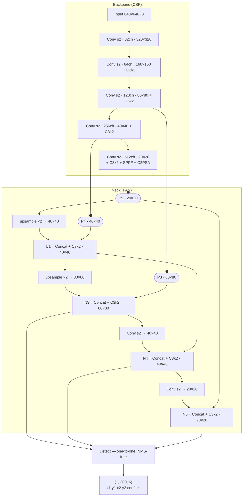

# Golf YOLO Detector — Model Card

The object detector behind the egocentric (AR-glasses / head-cam) golf pipeline: per-frame
`ball` / `club_head` boxes, consumed by the hit counter (`golf/hit_detector.py`) and the Android
live counter. Numbers measured 2026-07-10.

## Architecture

| | |
|---|---|
| Model | **YOLO26s**, fine-tuned on our egocentric footage (`golf_ego_v2_1280`) |
| Classes | 2 — `ball` (0), `club_head` (1) |
| Parameters / compute | **9.95 M** params · 22.5 GFLOPs @640 (~90 GFLOPs @1280) |
| Head | anchor-free, **end-to-end NMS-free** — no NMS post-processing on device |
| Output | `(1, 300, 6)` = 300 detections × `[x1, y1, x2, y2, conf, cls]`, already final |
| Input | RGB square letterbox — **1280×1280** offline, **640×640** on device |
| Weights | `runs/detect/golf_ego_v2_1280/weights/best.pt` → exported TFLite **float16** (`android/app/src/main/assets/golf.tflite`) |

## Benchmark

Egocentric validation set: **290 images / 448 boxes**, real AR-glasses footage (2048×1536
portrait, fisheye), split **video-disjoint** from training (no frame leakage).
`yolo val` @1280:

| Class | mAP50 | Precision | Recall |
|---|---|---|---|
| ball | 0.858 | 0.909 | 0.787 |
| club_head | 0.903 | 0.957 | 0.860 |
| **all** | **0.881** | **0.933** | **0.824** |

Known weakness: ball recall (small white ball at distance); club_head is strong.

## Model size

| Format | Size |
|---|---|
| TFLite float16 (deployed on Android) | **18.9 MB** |
| PyTorch checkpoint (`best.pt`) | 19.4 MB |

Both files store weights in **float16** — Ultralytics converts checkpoints to half precision when
it strips the optimizer at the end of training (9.95 M × 2 B ≈ 19.9 MB; a true fp32 file would be
~40 MB). The TFLite file is slightly smaller because it is the **fused** inference graph
(BatchNorm folded into convs: 9.47 M params) with no checkpoint metadata.

## Latency

Closest-to-phone setting we can measure today — the deployed TFLite f16 model at the deployed
input size, CPU only:

| Runtime | Setting | Latency / frame | Throughput |
|---|---|---|---|
| TFLite + XNNPACK, CPU, 4 threads | 640×640, f16 | **58 ms** | **~17 fps** |

Method: 8 warmup + 50 timed invokes, random input. On-device (ARM / GPU delegate) is not yet
benchmarked; this CPU number is the working proxy, and the app's CameraX `KEEP_ONLY_LATEST` loop
is bounded by it.

## Architecture diagram

Verified against the actual deployed checkpoint (layer-by-layer). Classic CSP backbone →
PAN neck → NMS-free detect head; feature-map sizes shown for the 640×640 device input.

Reading the diagram:
- **Backbone** downsamples ×2 five times (640 → 20) with C3k2 CSP blocks; the last stage adds
  SPPF (multi-scale pooling) and a C2PSA attention block.
- **Neck** fuses the three scales both ways (top-down upsampling, then bottom-up strided convs),
  so the small-ball scale (80×80) sees global context and the coarse scale sees detail.
- **Head** predicts directly per location on the three fused maps and emits a fixed top-300
  final list — no anchors, no NMS, which keeps the mobile runtime a single tensor read.
