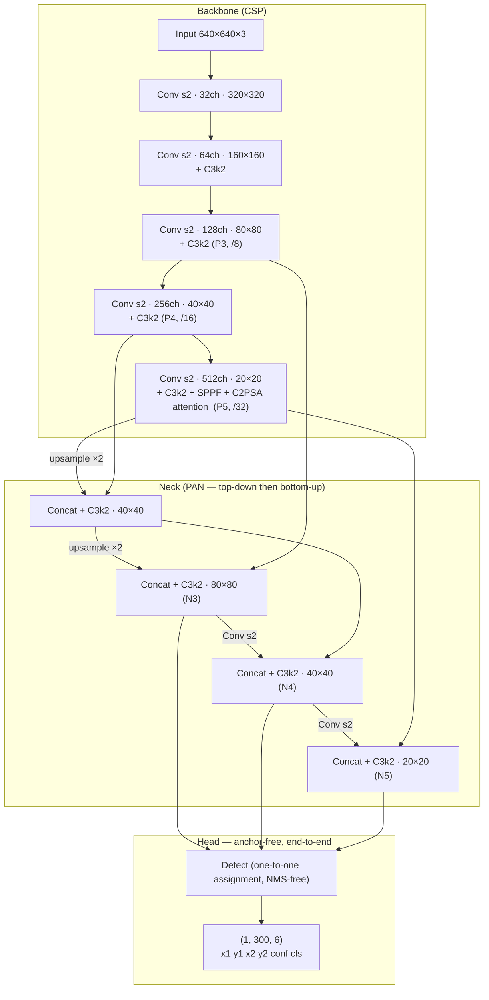

# Golf YOLO Detector — Model Card

The object detector behind the egocentric (AR-glasses / head-cam) golf pipeline: per-frame
`ball` / `club_head` / `hole` boxes, consumed by the hit counter (`golf/hit_detector.py`) and the
Android live counter. The 2-class ego numbers were measured 2026-07-10; the 3-class `hole` model
(`golf_ego_v3_hole` → `golf_ego_v4_hole`) added the putting-cup class 2026-07.

## Architecture

| | |
|---|---|
| Model | **YOLO26s**, fine-tuned on our egocentric footage (`golf_ego_v*_hole`) |
| Classes | 3 — `ball` (0), `club_head` (1), `hole` (2) |
| Parameters / compute | **9.95 M** params · 22.5 GFLOPs @640 (~90 GFLOPs @1280) |
| Head | anchor-free, **end-to-end NMS-free** — no NMS on device (but see the export note) |
| Output (on device) | 3 raw NHWC maps `[1,80,80,7] [1,40,40,7] [1,20,20,7]` (strides 8/16/32); per cell `[l,t,r,b, ball,club_head,hole logits]`, reg_max=1 (no DFL) |
| Input | RGB square letterbox — **1280×1280** offline, **640×640** on device |
| Weights | `runs/detect/golf_ego_v5_nomined/weights/best.pt` → raw-head TFLite **float16** (`android-golf/app/src/main/assets/golf_v<N>.tflite`; the app auto-loads the highest version and shows it in the HUD) |

### On-device head: RAW, not end-to-end

The offline `.pt` uses YOLO26's end-to-end NMS-free head (`(1,300,6)` final list). That head bakes
`TopK`/`GatherNd`/INT64 casts that **no mobile delegate (GPU or NPU) can run** → the whole model
falls back to CPU. So for the phone we re-export the **raw one-to-many head** (pure conv+attention)
and do threshold + per-class NMS in Kotlin (`GolfDetector.kt`). This is what lets the Qualcomm
Hexagon NPU take the graph whole (~18 ms @640 on the S25). Reproduce with:

```bash
uv run python golf/export_golf_rawhead_tflite.py \
    --weights runs/detect/golf_ego_v4_hole/weights/best.pt --out golf.tflite
```

The script monkeypatches `Detect.forward` (raw one2one maps) + `Attention.forward` (unrolled
matmuls) and runs `onnx2tf` with `enable_batchmatmul_unfold=False` — without those the C2PSA
attention shatters into ~1600 `FULLY_CONNECTED` ops and the delegate rejects it. It is
class-count-generic (2- or 3-class); the Kotlin decoder reads `nc` from the output shape, so only
`LABELS` in `GolfDetector.kt` needs the extra `"hole"` entry (already added). See the
`android-golf-npu-deploy` notes for the full NPU story.

## Benchmark

Egocentric validation set: **290 images / 448 boxes**, real AR-glasses footage (2048×1536
portrait, fisheye), split **video-disjoint** from training (no frame leakage). `yolo val` @1280.

2-class baseline (`golf_ego_v2_1280`, 2026-07-10):

| Class | mAP50 | Precision | Recall |
|---|---|---|---|
| ball | 0.858 | 0.909 | 0.787 |
| club_head | 0.903 | 0.957 | 0.860 |
| **all** | **0.881** | **0.933** | **0.824** |

3-class (`golf_ego_v4_hole`, 2026-07-21) on the same fixed val:

| Class | mAP50 | Precision | Recall |
|---|---|---|---|
| ball | 0.866 | 0.883 | 0.800 |
| club_head | 0.894 | 0.919 | 0.875 |
| **all** | **0.879** | **0.901** | **0.838** |

Δ vs baseline: mAP50 flat, **ball recall +0.013** — no forgetting from the added reviewed+mined
data. **`hole` recall is NOT in these numbers** — the fixed val predates the hole class and has no
hole labels; to actually track cup recall, add a few held-out hole-labeled putting clips to `--val`
and re-run `yolo val`. Known weakness carried over: ball recall (small white ball at distance).

## Model size

| Format | Size |
|---|---|
| TFLite float16 (deployed on Android) | **18.9 MB** |
| PyTorch checkpoint (`best.pt`) | 19.4 MB |

Both files store weights in **float16** — Ultralytics converts checkpoints to half precision when
it strips the optimizer at the end of training (9.95 M × 2 B ≈ 19.9 MB; a true fp32 file would be
~40 MB). The TFLite file is slightly smaller because it is the **fused** inference graph
(BatchNorm folded into convs: 9.47 M params) with no checkpoint metadata.

## Latency

Closest-to-phone setting we can measure today — the deployed TFLite f16 model at the deployed
input size, CPU only:

| Runtime | Setting | Latency / frame | Throughput |
|---|---|---|---|
| TFLite + XNNPACK, CPU, 4 threads | 640×640, f16 | **58 ms** | **~17 fps** |

Method: 8 warmup + 50 timed invokes, random input. On-device (ARM / GPU delegate) is not yet
benchmarked; this CPU number is the working proxy, and the app's CameraX `KEEP_ONLY_LATEST` loop
is bounded by it.

## Architecture diagram

Verified against the actual deployed checkpoint (layer-by-layer). Classic CSP backbone →
PAN neck → NMS-free detect head; feature-map sizes shown for the 640×640 device input.



Reading the diagram:
- **Backbone** downsamples ×2 five times (640 → 20) with C3k2 CSP blocks; the last stage adds
  SPPF (multi-scale pooling) and a C2PSA attention block.
- **Neck** fuses the three scales both ways (top-down upsampling, then bottom-up strided convs),
  so the small-ball scale (80×80) sees global context and the coarse scale sees detail.
- **Head** predicts directly per location on the three fused maps and emits a fixed top-300
  final list — no anchors, no NMS, which keeps the mobile runtime a single tensor read.
